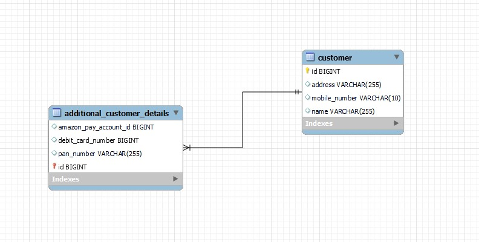
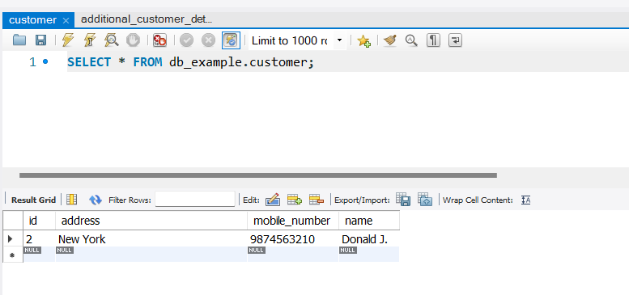
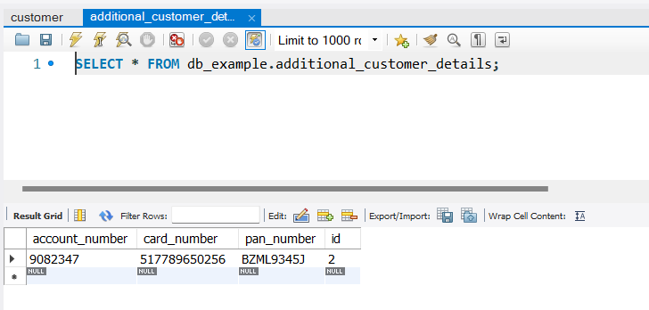

## Introduction

The `@SecondaryTable` annotation is typically used in conjunction with the `@Entity` annotation to define a persistent entity class in JPA (Java Persistence API). By default, JPA maps each entity to a single table in the database, but using `@SecondaryTable` allows you to map an entity to additional tables.

#### How is it different from one-to-one mapping?
The benefit of using `@SecondaryTable` over a `@OneToOne` mapping in Spring Boot is that it allows you to split an entity's attributes into multiple tables without having to create a **separate entity** for each table. This can be useful when you want to optimize database performance by reducing the size of each table.

Here are some specific benefits of using `@SecondaryTable`:

1. **Simplifies data retrieval**: When you use `@SecondaryTable`, the entity's attributes are split across multiple tables but can be retrieved in a **single query**. This can simplify your data retrieval logic, especially if you have a lot of data to retrieve.

2. **Improves database performance**: If you have a large number of attributes in your entity, splitting them across multiple tables can improve database performance by reducing the size of each table. This can make queries run faster and reduce the load on your database server.

3. **Increases flexibility**: Using `@SecondaryTable` allows you to add or remove attributes from your entity without having to create or modify a separate entity for each table. This can increase the flexibility of your database schema and make it easier to manage.

Let's see an example.

### Entity Model
The following entity is mapped to a primary table `customer` and a secondary table `additional_customer_details`. The fields that are required to be stored in secondary table, have `table` attribute of `@Column` set to `additional_customer_details`.
>By default, the `table` attribute is set to primary table's name.

```java
@Entity
@SecondaryTable(name = "additional_customer_details")
@Table(name = "customer")
public class Customer {
    @Id
    @GeneratedValue(strategy = GenerationType.AUTO)
    @Column(name = "id", nullable = false)
    private Long id;

    @Column(name = "name")
    private String name;

    @Column(name = "address")
    private String address;

    @Column(name = "mobile_number")
    private String mobileNumber;

    @Column(name = "pan_number", table = "additional_customer_details")
    private String panNumber;

    @Column(name = "account_id", table = "additional_customer_details")
    private Long accountNumber;

    @Column(name = "card_number", table = "additional_customer_details")
    private Long cardNumber;
}
```

The following SQL model represents relation between `customer` and `additional_customer_details` tables.



### Repository
`CustomerRepository` extends `JpaRepository` to support CRUD operations.
```java
public interface CustomerRepository extends JpaRepository<Customer, Long> {
}
```
### Service
The `CustomerService` class contains methods to perform Create/Read/Update/Delete operations in DB.
```java
@Service
public class CustomerService {

    @Autowired
    private CustomerRepository customerRepository;
    
    // save a customer in DB and returns the ID
    public Long createCustomer(Customer customer) {
        return customerRepository.save(customer).getId();
    }
    
    // get list of all customer available in DB
    public List<?> getAllCustomers() {
        return customerRepository.findAll();
    }
    
    // update an existing customer and return the updated object
    public Object updateExistingCustomer(Customer customer, Long id) {
        Optional<Customer> optionalCustomer = customerRepository.findById(id);
        if (!optionalCustomer.isPresent()) return "No customer found with id: " + id;
        customer.setId(id);
        return customerRepository.save(customer);
    }
    
    // delete an existing customer and return the deleted object
    public Object deleteExistingCustomer(Long id) {
        Optional<Customer> optionalCustomer = customerRepository.findById(id);
        if (!optionalCustomer.isPresent()) return "No customer found with id: " + id;
        Customer deletedCustomer = optionalCustomer.get();
        customerRepository.deleteById(id);
        return deletedCustomer;
    }
}
```

### Controller
The `CustomerController` class exposes the methods of `CustomerService` as REST end-points.
```java
@RestController()
@RequestMapping(path = "/api/customer")
public class CustomerController {

    @Autowired
    private CustomerService customerService;
    
    @PostMapping("/")
    public Long saveCustomer(@RequestBody Customer customer) {
        return customerService.createCustomer(customer);
    }
    
    @GetMapping("/customers")
    public List<?> getAllCustomers() {
        return customerService.getAllCustomers();
    }
    
    @PutMapping("/update/{id}")
    public Object updateCustomer(@RequestBody Customer customer, @PathVariable Long id) {
        return customerService.updateExistingCustomer(customer, id);
    }
    
    @DeleteMapping("/delete/{id}")
    public Object deleteCustomer(@PathVariable Long id) {
        return customerService.deleteExistingCustomer(id);
    }
}
```
### DB operations
Using REST end-points, we can perform read and write operations in DB.

The given JSON object represents a `Customer`
```json
{
    "name": "Donald J.",
    "address": "New York",
    "mobileNumber": "9874563210",
    "panNumber": "BZML9345J",
    "accountNumber": 9082347,
    "cardNumber": 517789650256
}
```
When this payload is inserted in DB, the data is inserted into `customer` and `additional_customer_details` table.




The SQL queries executed by hibernate is shown below.
```text
insert into customer (address, mobile_number, name, id) values (?, ?, ?, ?)
insert into additional_customer_details (account_number, card_number, pan_number, id) values (?, ?, ?, ?)
```

### Conclusion
Overall, `@SecondaryTable` is a useful tool in Spring Boot for mapping a single entity to multiple tables and simplifying the management of complex database schemas.

